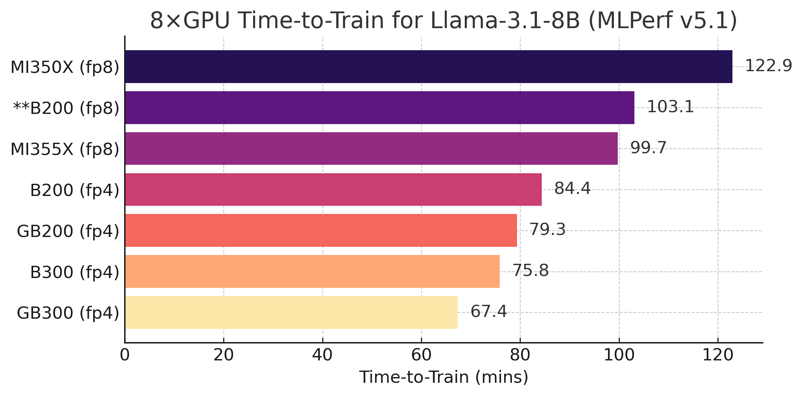
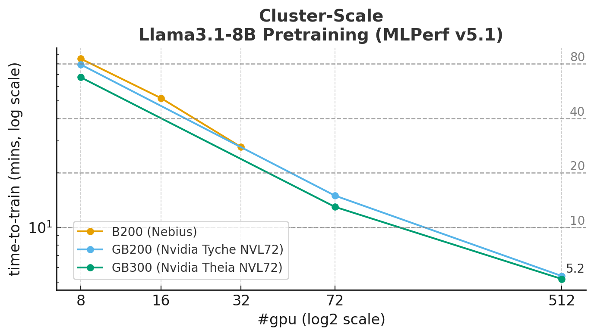
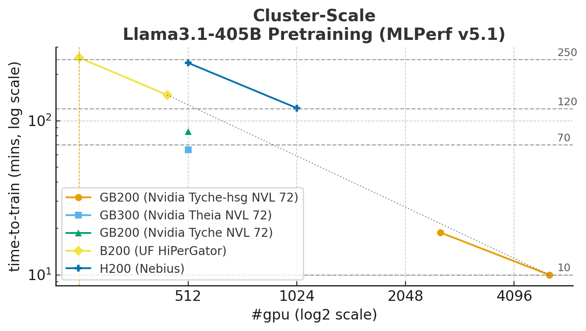
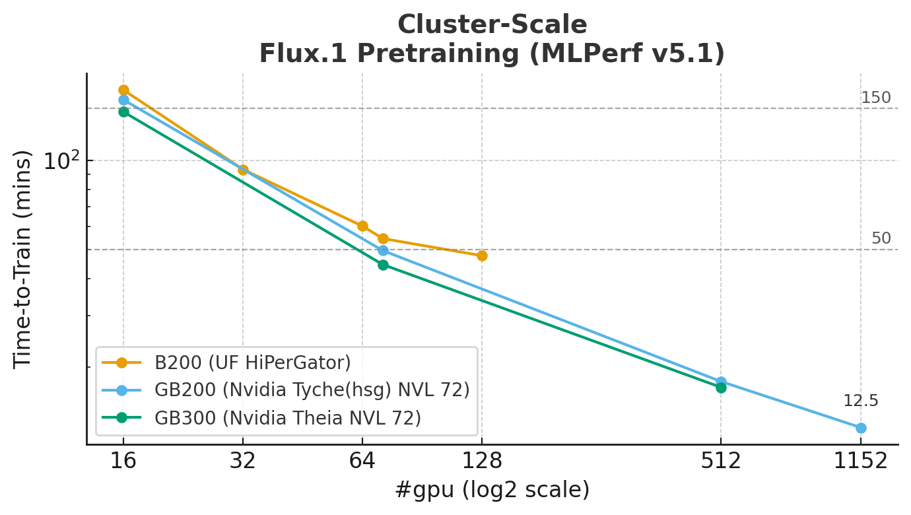

### Quick Rundown of MLPerf v5.1 Training 
*on the New Llama3.1-8B, Flux.1 Models.* — 2025/11/13

Few days ago, MLCommons [released][v5.1-rel-news] the MLPerf Training v5.1 results, with a record level of participation.

Combed through the [data][tableau-v5.1] for my own use, and figured might as well share it. Docker instructions are included to reproduce the runs locally, intentional bypass the needs of SLURM system and terabytes of download.

MLPerf covers many benchmarks, but here focuses only on the new ones: [Llama3.1-8B][new-llama3.1-8b] (405B), and [Flux.1][new-flux.1], and only the GPU submissions as these represent the most widely used today.

Links:
* [MLCommons Release News][v5.1-rel-news], [Github][v5.1-github]
* [MLPerf Training v5.1 Full Results][tableau-v5.1]
* [NVIDIA's Blog][nvd-v5.1-blog], [Tech Dive][nvd-v5.1-tech]
* [AMD's Blog][amd-v5.1-blog], [Tech Dive][amd-v5.1-tech], [Repro Tutorials][amd-v5.1-tuts]
* Others: [a][nebius], [b][hpwire]

Maybe useful: for local single node 8xGPU runs, [nvidia][vs-dhub-nvd]/[steps][vs-step-nvd], [amd][vs-dhub-amd]/[steps][vs-step-amd]. llama3.1-8b for now. Flux may follow.

----
### Per GPU Model x 8

| time-to-train (mins) | GPU            | Organization      | Public ID |
|----------------------|----------------|-------------------|-----------|
| 122.929              | MI350X (fp8)   | AMD               | 5.1-0017  |
| 99.709               | MI355X (fp8)   | AMD               | 5.1-0018  |
| 84.379               | B200 (fp4)     | Nvidia/Supermicro | 5.1-0081  |
| 79.325               | GB200 (fp4)    | Nvidia            | 5.1-0067  |
| 75.841               | B300 (fp4)     | Nvidia/Nebius     | 5.1-0008  |
| 67.373               | GB300 (fp4)    | Nvidia            | 5.1-0058  |
Datasheet: [B300][b300-datasheet], [B200][b200-datasheet], [MI355X][mi355x-datasheet], [MI350X][mi350x-datasheet].

* We only take the fastest per GPU type and only 8xGPU submissions here. Most NVIDIA GPU submissions are evaluated in FP4, whereas AMD GPU submissions are conducted in FP8. 

* ** in the figure is [our estimate](./assets/b200_fp8_estimate.png) on B200 fp8 based on the provided FP8 recipe included in the submission. The intent is to approximate the performance uplift achievable when transitioning from FP8 to FP4. We measure elapsed time per training and validation step and assume the same number of steps to convergence as FP4. This estimate is slightly optimistic, as it accounts only for the training and evaluation loops and excludes miscellaneous overheads, which can contribute up to an additional ~5% based on logs from other submissions.

* For an 8×B200 setup training Llama-3.1-8B under these hyperparameters, **our estimate leads to a 1.22× speedup when moving from FP8 to FP4**. This aligns with our [early](https://github.com/vuiseng9/nemo-perf-nvfp4/tree/main) local benchmarking results observed when NVFP4 recipe was first released in Transformer Engine. While the two benchmarks differs in hyperparameters, I generally keep in mind that the expected gain is around 20%, though it ultimately depends on the specific hyperparameters.

* MI355X edges B200 in fp8 comparison. While it aligns to on paper HW spec, the comparison is inherently difficult given config differences (batch size, attention implementation, ...). E.g. AMD uses batch size 32 vs 16 on Nvidia side, it means AMD is running half of gradient updates while Nvidia has smaller load per forward/backward pass. It is not clear which has the advantage here, as software implementation/optimization could differ a great deal too. Also in practice, we do care about the RDMA interconnects for scale out training which these sets of numbers do not reflect. 

* [How][nvd-v5.1-blog] (G)B300 (Blackwell Ultra) get so fast? 
    * Industry's first FP4 recipe using NVFP4 precision (with last few iterations in FP8).
    * 1.5× Tensor Core uplift over (G)B200
    * 2× attention speed via HW-accelerated Softmax
    * FP8 BMM in Attention, previously in BF16
* GBs faster than Bs are likely due to NVLinked Grace CPU-GPU.

* AMD's [optimizations][amd-v5.1-blog]: GEMM Tile Sizing, BF16 FlashAttention v3, DataLoader Tuning (15mins->3mins validation). See the blog for LORA optimization.

* Optional Contexts:
    * Training specifics: 12288 train, 1024 eval samples per train-eval loop. Typically takes 172,032 samples to reach convergence. Sequence length 8192, batch size depends, 16 Nvidia, 32 AMD. 
    * Advanced features in [NVFP4 paper][nvfp4-paper] such as stochastic rounding, rotation-based 2D quantization are disabled, most likely means that it behaves just like fp8 recipe except that nvfp4 is used.

----
### *Almost* Log-linear Cluster Scaling
*Train 8B, 405B LLM and a Flux.1 in one bio break, if you have thousands of GPUs. Okay, hyped but not too far 😆*

### 8B

### 405B

---
### Flux.1 (11.9B)

> Results from more organizations available, we only pick those with large range of GPU counts.

On TorchTitan framework, most likely BF16/32? unless torchao is used. To find out.

[//]: # (Links)

[vs-dhub-nvd]: https://hub.docker.com/repository/docker/vuiseng9/mlperfv5.1-nvidia-smci/general
[vs-step-nvd]: https://github.com/vuiseng9/mlperf-train-v5.1/blob/251112-local/Supermicro/benchmarks/llama31_8b/implementations/Blackwell_llama31_8b/HOW_TO_RUN_LOCAL.md
[vs-dhub-amd]: https://hub.docker.com/repository/docker/vuiseng9/mlperfv5.1-amd-llama31_8b/general
[vs-step-amd]: https://github.com/vuiseng9/mlperf-train-v5.1/blob/251112-local/AMD/benchmarks/llama31_8b/implementations/MI355X_EPYC_9575F_pytorch_llama3_8b/HOW_TO_RUN_LOCAL.md
[v5.1-rel-news]: https://mlcommons.org/2025/11/training-v5-1-results
[v5.1-github]: https://github.com/mlcommons/training_results_v5.1
[tableau-v5.1]: https://mlcommons.org/benchmarks/training/
[nvd-v5.1-blog]: https://blogs.nvidia.com/blog/mlperf-training-benchmark-blackwell-ultra/
[nvd-v5.1-tech]: https://developer.nvidia.com/blog/nvidia-blackwell-architecture-sweeps-mlperf-training-v5-1-benchmarks
[amd-v5.1-blog]: https://www.amd.com/en/blogs/2025/accelerating-ai-training.html
[amd-v5.1-tech]: https://rocm.blogs.amd.com/artificial-intelligence/mlperf-training-v5.1/README.html
[amd-v5.1-tuts]: https://rocm.blogs.amd.com/artificial-intelligence/mlperf-training5.1-repro/README.html
[nebius]: https://nebius.com/blog/posts/mlperf-training-v5-1-results
[hpwire]: https://www.hpcwire.com/aiwire/2025/11/12/mlcommons-releases-mlperf-training-v5-1-results/
[new-llama3.1-8b]: https://mlcommons.org/2025/10/training-llama-3-1-8b/
[new-flux.1]: https://mlcommons.org/2025/10/training-flux1/
[b300-datasheet]: https://resources.nvidia.com/en-us-dgx-systems/dgx-b300-datasheet
[b200-datasheet]: https://resources.nvidia.com/en-us-dgx-systems/dgx-b200-datasheet
[mi355x-datasheet]: https://www.amd.com/content/dam/amd/en/documents/instinct-tech-docs/product-briefs/amd-instinct-mi355x-gpu-brochure.pdf
[mi350x-datasheet]: https://www.amd.com/content/dam/amd/en/documents/instinct-tech-docs/product-briefs/amd-instinct-mi350x-gpu-brochure.pdf
[nvfp4-paper]: https://arxiv.org/abs/2506.08027